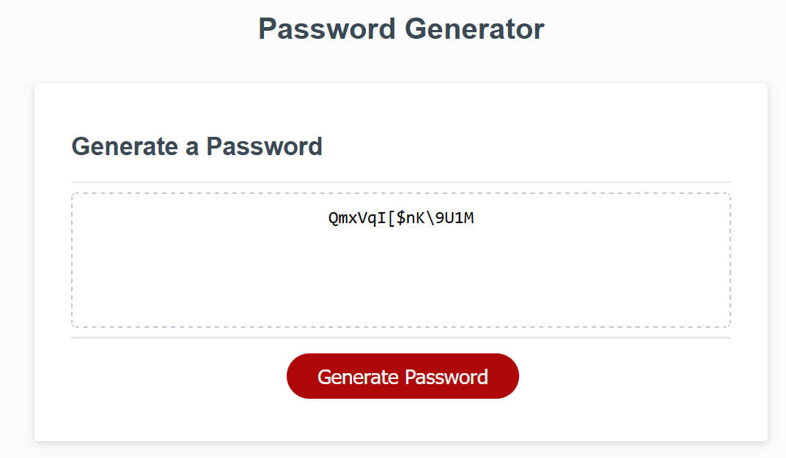

# Password Generator

# Description

A website application to generate a password randomly using specified criteria set by the user.
 
# Installation

Open the link in a modern browser (Tested on Firefox and Chrome): https://therandommer.github.io/Password-Generator/

# Usage

When you open the site in your browser you should see a site that looks like the screenshot below:

Click the "Generate Password" button. Follow the instructions your browser sends to you (Ensure pop-ups from websites are enabled).
After you follow the instructions a password should be generated in the text field that meets your specifications (length, character types, etc.).

## Desktop

## License

Using MIT License.